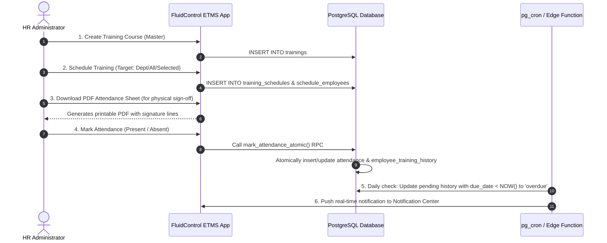

# FluidControl ETMS — Architecture & Data Flow

This document details the system design, database schema, data flows, and security architecture of the **FluidControl Employee Training Management System**.

---

## 1. High-Level Architecture Diagram

```
+-------------------------------------------------------------------------+
|                              CLIENT TIER                                |
|   React 18 + TypeScript + Tailwind CSS + Lucide Icons + jsPDF / SheetJS |
|                                                                         |
|  [ Dashboard ]  [ Trainings ]  [ Employees ]  [ Schedules ] [ Attendance]
|  [ Calendar  ]  [ Quizzes   ]  [ Materials ]  [ Alerts    ] [ Reports   ]
+------------------------------------+------------------------------------+
                                     |
                         HTTPS / PostgREST / WSS
                                     |
+------------------------------------v------------------------------------+
|                         BACKEND SERVICES (Supabase)                     |
|                                                                         |
|  +-------------------+  +-------------------+  +---------------------+  |
|  |   Supabase Auth   |  | PostgREST API     |  | Supabase Storage    |  |
|  |   (JWT / Session) |  | (Row Level Sec.)  |  | (Materials & Docs)  |  |
|  +-------------------+  +-------------------+  +---------------------+  |
|                                                                         |
|  +-------------------------------------------------------------------+  |
|  |                     PostgreSQL Database Engine                    |  |
|  |  - trainings                 - employees                          |  |
|  |  - departments               - training_schedules                 |  |
|  |  - schedule_employees        - attendance                         |  |
|  |  - employee_training_history - quizzes                            |  |
|  |  - training_materials        - notifications                      |  |
|  |  - audit_logs                                                     |  |
|  +-------------------------------------------------------------------+  |
|                                                                         |
|  +-------------------+                          +--------------------+  |
|  |   pg_cron Engine  |                          |   Edge Functions   |  |
|  |   (Daily Overdue) | -----------------------> | (Send Reminders)   |  |
|  +-------------------+                          +--------------------+  |
+-------------------------------------------------------------------------+
```

---

## 2. Core Data Flow: Training Lifecycle



---

## 3. Database Schema Overview

| Table | Purpose | Key Constraints |
|---|---|---|
| `departments` | Organizational units (e.g. Production, QA, HR). | `id` PK, `name` UNIQUE NOT NULL |
| `employees` | Employee master records with department mapping. | `id` PK, `employee_code` UNIQUE, `email` format check |
| `trainings` | Master list of training courses & frequencies. | `id` PK, `name` UNIQUE NOT NULL |
| `training_schedules` | Scheduled sessions linked to a training and trainer. | `id` PK, `training_id` FK, `scheduled_date` |
| `schedule_employees` | Junction table resolving employees assigned to a schedule. | Composite UNIQUE (`schedule_id`, `employee_id`) |
| `attendance` | Marked attendance status (present / absent) per employee. | Composite UNIQUE (`schedule_id`, `employee_id`) |
| `employee_training_history` | Historical compliance log per employee and training cycle. | `status` CHECK ('completed', 'pending', 'overdue') |
| `quizzes` | Assessment form links and passing scores. | `schedule_id` FK, `form_link` NOT NULL |
| `training_materials` | Uploaded document assets (PDF, video links). | `training_id` FK, `file_url` |
| `notifications` | System alerts, overdue warnings, reminder emails. | `status` ('pending', 'sent', 'failed') |
| `system_settings` | Zero-hardcoding configuration store for HR rules, branding, and templates. | `key` PK, `value` JSONB NOT NULL |
| `audit_log` | Append-only system security and change audit trail. | PostgreSQL trigger `trg_protect_audit_log` forbids `UPDATE`/`DELETE` |

---

## 4. Zero-Hardcoding Architecture

All operational parameters, training recurrence frequencies, company profile details, email reminder copy, and compliance thresholds reside in `system_settings` in PostgreSQL:
1. **Dynamic Load**: Components read configurations via `getSystemSetting()` in `src/lib/settings.ts`.
2. **In-Memory Cache**: Settings are cached for 60 seconds to eliminate redundant network roundtrips.
3. **HR Administration**: HR administrators manage all settings directly via `/settings` without touching code or triggering redeployments.
4. **CI Guard**: Automated script `npm run check-hardcoding` validates that future commits do not introduce static business branch rules or hardcoded constants.

---

## 5. Document & Export Generation Pipeline

- **PDF Generation**: High-performance client-side rendering via `jspdf` and `jspdf-autotable`. Includes automatic page numbering, corporate header, table splitting with repeating column headers, and color-coded status badges.
- **Excel & CSV Generation**: Powered by `xlsx` and custom UTF-8 BOM encoding. User input is sanitized through `sanitizeFormulaInjection()` in `src/lib/excel.ts` to neutralize Formula Injection (DDE) vectors (`=`, `+`, `-`, `@`).
- **Print Layout**: Media print stylesheet rules in `index.css` and dedicated zero-margin iframe print renderers ensure pixel-perfect physical document output.

