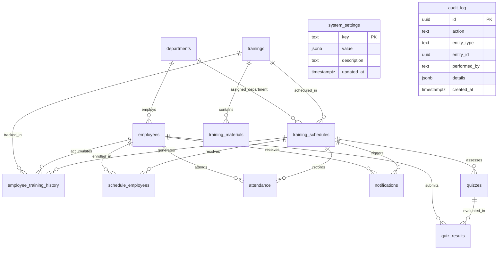

# Fluid Controls ETMS — Full System Map & Architecture Baseline

**Document Version:** 1.0 (Pre-Go-Live Master Audit)  
**Date:** October 2026  
**System:** Fluid Controls Employee Training Management & Compliance System (ETMS)

---

## 1. Codebase File Inventory & Classification

```
e:\FluidControls\
├── public/
│   ├── favicon.png                  [Asset: Official Browser Tab Icon]
│   └── logo.png                     [Asset: Official Corporate Emblem]
├── scripts/
│   ├── check-hardcoding.js          [Audit: Zero-Hardcoding CI Guard]
│   └── reconciliation-test.js       [Audit: Data Lifecycle & Reconciliation Test Suite]
├── src/
│   ├── App.tsx                      [Core Route Entry & Provider Scaffold]
│   ├── main.tsx                     [Client Entry Point]
│   ├── index.css                    [Design System Tokens & Styles]
│   ├── components/
│   │   ├── layout/
│   │   │   ├── AppLayout.tsx         [Main Shell with Sidebar, Header & Brand]
│   │   │   ├── NotificationCenter.tsx[Notification Bell & Quick Tray]
│   │   │   └── UserProfileMenu.tsx   [User Profile Dropdown & Preferences]
│   │   └── ui/                      [shadcn/ui Design Components]
│   │       ├── avatar.tsx
│   │       ├── badge.tsx
│   │       ├── button.tsx
│   │       ├── card.tsx
│   │       ├── checkbox.tsx
│   │       ├── dialog.tsx
│   │       ├── dropdown-menu.tsx
│   │       ├── input.tsx
│   │       ├── label.tsx
│   │       ├── popover.tsx
│   │       ├── select.tsx
│   │       ├── separator.tsx
│   │       ├── switch.tsx
│   │       ├── tabs.tsx
│   │       └── textarea.tsx
│   ├── contexts/
│   │   └── AuthContext.tsx          [Supabase Auth Provider & Session State]
│   ├── lib/
│   │   ├── audit.ts                 [Audit Log Dispatcher]
│   │   ├── excel.ts                 [Sanitized Excel/CSV Export & Formula Escaping]
│   │   ├── pdf.ts                   [Vector PDF Report & Attendance Sheet Generator]
│   │   ├── settings.ts              [Cached System Settings & Lookup Manager]
│   │   ├── supabase.ts              [Supabase Client Configuration]
│   │   └── utils.ts                 [Date Formatting & Status Badge Resolvers]
│   ├── pages/
│   │   ├── AttendancePage.tsx       [Transactional Batch Attendance & Print Roster]
│   │   ├── DashboardPage.tsx        [KPI Summary Cards, Recharts, Upcoming Alert]
│   │   ├── EmployeesPage.tsx        [Employee Master, Dept CRUD, Excel/CSV Template & Import]
│   │   ├── LoginPage.tsx            [Auth Screen with Brand Splash]
│   │   ├── MaterialsPage.tsx        [Training Resource Uploader & Storage Integrator]
│   │   ├── NotificationsPage.tsx    [Email Alert Queue & Manual Dispatcher]
│   │   ├── QuizzesPage.tsx          [Google Form Assessment Link Manager]
│   │   ├── ReportsPage.tsx          [Compliance Master Logs, Filter Matrix, PDF/Excel/Print]
│   │   ├── SchedulesPage.tsx        [Google Calendar Grid + List Scheduler & Group Resolver]
│   │   ├── SettingsPage.tsx         [System Settings, Branding, Rules, & Email Templates]
│   │   └── TrainingsPage.tsx        [Course Catalog Master & Recurrence Manager]
│   └── types/
│       ├── database.ts              [Auto-Generated Database Interfaces]
│       └── index.ts                 [Domain Model & Frontend State Types]
├── database_setup.sql               [PostgreSQL DDL, RPCs, Storage & Immutable Triggers]
├── package.json                     [Project Dependencies & NPM Scripts]
├── tailwind.config.js               [Tailwind Design Tokens]
├── tsconfig.json                    [TypeScript Configuration]
└── vite.config.ts                   [Vite Build Engine Configuration]
```

---

## 2. Live Entity-Relationship Diagram (ERD)



---

## 3. Screen-to-Data Route Matrix

| Route | Primary Component | Tables Read | Tables / RPCs Written | Functional Purpose |
|---|---|---|---|---|
| `/login` | `LoginPage` | `auth.users` | `supabase.auth.signInWithPassword` | Administrator Authentication |
| `/dashboard` | `DashboardPage` | `trainings`, `employees`, `training_schedules`, `employee_training_history`, `departments` | RPC `refresh_overdue_training_statuses` | Executive KPIs, Trends & Overdue Metrics |
| `/trainings` | `TrainingsPage` | `trainings` | `trainings`, `audit_log` | Course Catalog & Recurrence CRUD |
| `/schedules` | `SchedulesPage` | `training_schedules`, `trainings`, `departments`, `employees`, `schedule_employees` | `training_schedules`, `schedule_employees`, `employee_training_history`, `audit_log` | Calendar View & Audience Resolution |
| `/employees` | `EmployeesPage` | `employees`, `departments` | `employees`, `departments`, `audit_log` | Workforce Directory, Batch Import/Export |
| `/attendance` | `AttendancePage` | `training_schedules`, `schedule_employees`, `attendance`, `employees` | RPC `mark_attendance_and_update_history`, `attendance`, `employee_training_history`, `audit_log` | Atomic Roster Grading & PDF Export |
| `/quizzes` | `QuizzesPage` | `training_schedules`, `quizzes` | `quizzes`, `audit_log` | Assessment Link Management |
| `/materials` | `MaterialsPage` | `trainings`, `training_materials` | `storage.objects`, `training_materials`, `audit_log` | Document & Video SOP Library |
| `/emails` | `NotificationsPage` | `notifications`, `training_schedules`, `employees` | `notifications`, `audit_log` | Alert Queue & Email Dispatch |
| `/reports` | `ReportsPage` | `employee_training_history`, `trainings`, `departments`, `employees`, `training_schedules` | RPC `refresh_overdue_training_statuses` | Full Compliance Audit, Vector Print & Exports |
| `/settings` | `SettingsPage` | `system_settings` | `system_settings`, `audit_log` | Zero-Hardcoding Control Panel |
